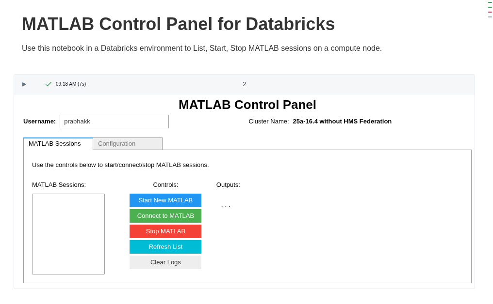

# MATLAB on Databricks

This repository contains utilities and resources to run MATLAB&reg; in your Databricks&reg; environment.

> [!NOTE] 
> This repository is under active development.

## Requirements

- Databricks workspace with cluster creation permissions
- Licensing
   - Access to a Network License Manager for MATLAB
   - or Access to Online Licensing from your Databricks workspace
- Docker (for building custom containers)

## Beta Release (October 2025)

This release focuses on enabling interactive development using the MATLAB Desktop running within a Databricks cluster.

The goal is to provide resources, that enable you to:
1. **Build**  : Build a Docker image, with MATLAB.
2. **Deploy** : Deploy this image into your Cloud Provider
3. **Create** : Create a compute cluster with this Image in your Databricks environment
4. **Access** : Start/Stop and Connect to MATLAB Sessions in the cluster using a Notebook based Control Panel UI.


### Build Docker Image

[Databricks Container Services](https://docs.databricks.com/aws/en/compute/custom-containers) enable the use of a Docker image to use with the compute cluster.

Build the Databricks compatible [Dockerfile](./dockerfiles/matlab/Dockerfile) with an image containing MATLAB, its dependencies, and python packages to use MATLAB. The python packages [matlab-proxy](https://pypi.org/project/matlab-proxy/) and [matlab-engine-for-python](https://pypi.org/project/matlab-engine-for-python/) provide distinct approaches to interacting with MATLAB.

The [MATLAB Proxy](https://github.com/mathworks/matlab-proxy) package enables browser based interactive access to a MATLAB Desktop, while the [MATLAB Engine for Python](https://github.com/mathworks/matlab-engine-for-python) is well suited for command line access from python environments like notebooks.

Execute the following on a Docker enabled machine to build the default image:

```bash

## Clone or download this repository and navigate into it on your command line.
git clone https://github.com/mathworks-ref-arch/matlab-on-databricks.git && cd matlab-on-databricks

# Build the default image
docker build -t matlab-on-databricks:R2025b -f dockerfiles/matlab/Dockerfile .
```

For detailed instructions on customizing the image, refer to this [README](./dockerfiles/matlab/README.md).


Execute the following to test the built image:

```bash
docker run -it --rm -p 8888:8888 -u ubuntu --entrypoint /databricks/python3/bin/matlab-proxy-app matlab-on-databricks:R2025b

# Click on the printed URL on the terminal to launch the MATLAB Desktop in your browser

```

For your convenience, a prebuilt version of this default image is available on the GitHub Container Registry (GHCR) under the organization `mathworks-ref-arch`.

To pull this image, use the following Docker command:
```bash
docker pull ghcr.io/mathworks-ref-arch/matlab-on-databricks/matlab-on-databricks:R2025b
```

### Deploying Image to Cloud Provider

Once you are satisfied with the image , you can push it to your cloud provider's container registry, or to dockerhub.

Refer to this [Documentation from Databricks](https://docs.databricks.com/aws/en/compute/custom-containers#step-2-push-your-base-image) to push the images to a Docker registry.

Refer to the [Push to ACR](./dockerfiles/PushToACR.md) documentation for Azure Container Registry (ACR) specific instructions. 

Once again, if you prefer to use the pre-built image from the GitHub Container Registry (GHCR), specify the image name as `ghcr.io/mathworks-ref-arch/matlab-on-databricks/matlab-on-databricks:R2025b` on the [Create Compute Page](https://docs.databricks.com/aws/en/compute/configure) -> Advanced -> Docker Tab -> Use your own Docker Container -> Docker Image URL


### Create Compute Cluster with Container Image

Follow this [documentation from Databricks](https://docs.databricks.com/aws/en/compute/custom-containers#launch-your-compute-using-the-ui) lists the steps to create a compute cluster using the custom container you made available to your Databricks environment in the previous step.

Refer to the [Push to ACR](./dockerfiles/PushToACR.md#to-pull-your-image-from-databricks) documentation for Azure Container Registry (ACR) specific instructions.

### Access MATLAB Desktop running on Compute Cluster

The container image deployed in the previous steps include the [MATLAB Proxy Application](https://github.com/mathworks/matlab-proxy) which allows interactive browser-based access to MATLAB Desktop. 

The notebook [MATLAB_Control_Panel.ipynb](./notebooks/MATLAB_Control_Panel.ipynb) provides a widget based interface to call this application and generate links to access the MATLAB Desktop running on the Databricks compute cluster.



Click `Start New MATLAB` followed by `Open MATLAB` buttons to be presented with the MATLAB Desktop in a new browser tab.

To start MATLAB, login using Online Licensing on the presented screen, or enter the Network License Manager address on this page:


> [!TIP]
> Depending on your Databricks workspace configuration, it might be possible to import this GitHub repository directly into your workspace. Otherwise, please find a way to get the `notebooks` folder into your  .
>


## Feedback

We encourage you to try this repository with your environment and provide feedback. 
If you encounter a technical issue or have an enhancement request, create an issue [here](https://github.com/mathworks-ref-arch/matlab-on-databricks/issues)


---------------

Copyright 2025 The MathWorks, Inc.

---------------